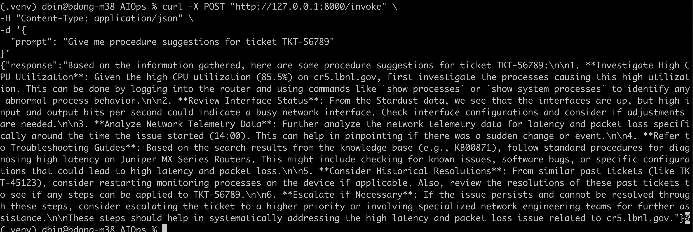
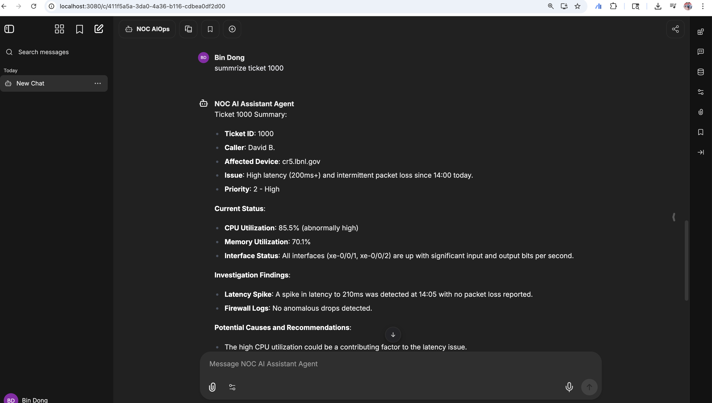
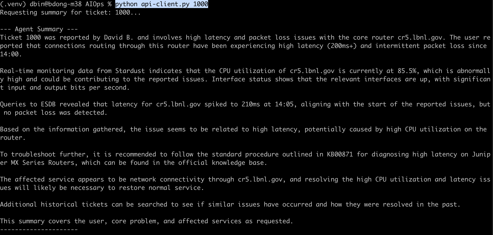

# AIOps Assistant for NOC

This project provides an AI agent designed to assist with NOC tasks like summarizing tickets and suggesting resolution procedures.

## Architecture

The agent is built using LangChain and is exposed via a FastAPI server, providing two main interfaces:

1.  **Direct API (`/invoke`):** A simple endpoint designed for programmatic integration with systems like ServiceNow.
2.  **GUI Interface (`/v1/chat/completions`):** An OpenAI-compatible endpoint that allows you to connect this agent to popular chat GUIs like [LibreChat](https://github.com/danny-avila/LibreChat).

## Setup

1.  **Clone the repository:**
    ```bash
    git clone https://github.com/BinDong314/AIOps
    cd AIOps
    ```

2.  **Create a virtual environment:**
    ```bash
    python3.10 -m venv .venv
    source .venv/bin/activate  # On Windows, use `venv\Scripts\activate`
    ```

3.  **Install dependencies:**
    ```bash
    pip install -r requirements.txt
    ```

4.  **Configure environment variables:**
    -   Copy the example `.env.example` file to `.env`:
        ```bash
        cp env.example .env
        ```
    -   Edit the `.env` file and add your `OPENAI_API_KEY`.

5.  **Run the server:**
    ```bash
    uvicorn main:app --reload
    ```
    The server will be running at `http://127.0.0.1:8000`.

## How to Use

### 1. Direct API (for ServiceNow)

You can send a POST request to the `/invoke` endpoint.

**Example using `curl`:**
```bash
curl -X POST "http://127.0.0.1:8000/invoke" \
-H "Content-Type: application/json" \
-d '{
  "prompt": "Give me procedure suggestions for ticket TKT-56789"
}'
```



### 2. How to connect with LibreChat
See doc to install LibreChat here https://www.librechat.ai/docs/quick_start/local_setup

How to build the Custom Endpoints, follow the instruction here.
When you have the librechat.yaml file, add below to your librechat.yaml

```bash
version: 1.2.8
cache: true
endpoints:
  custom:
    - name: "NOC AI Assistant Agent"          # This is the name that will appear in the UI dropdown.
      apiKey: "dddd"   # We'll set this to a placeholder in the .env file.
      baseURL: "http://host.docker.internal:8000/v1" # The crucial URL to your agent.
      models:
        default: ["NOC AIOps"]   # The "model name" your agent represents.
        fetch: false                    # Set to false because our simple agent does not have a /v1/models endpoint to list models.
      titleConvo: true                  # Allows the agent to set the conversation title.
      titleModel: "current_model"       # Uses the agent itself to generate the title.
      summarize: false                  # You can turn this on later if needed.
      summaryModel: "current_model"
      forcePrompt: false                # Our agent doesn't need a special system prompt.
      modelDisplayLabel: "NOC AI Assistant Agent"   # A friendly label in the UI.

```
Then, do shutdown and restart Librechat container (restart does not work)
```bash
docker compose down
docker compose up -d
```


### 2. How to connect with python

```bash
python api-client.py 1000
```
